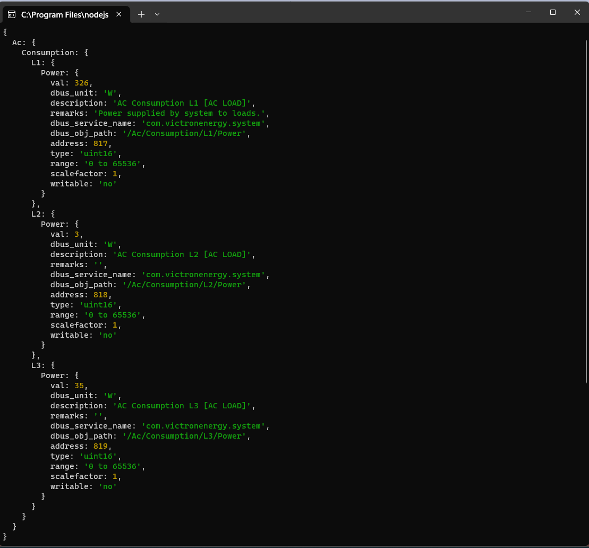
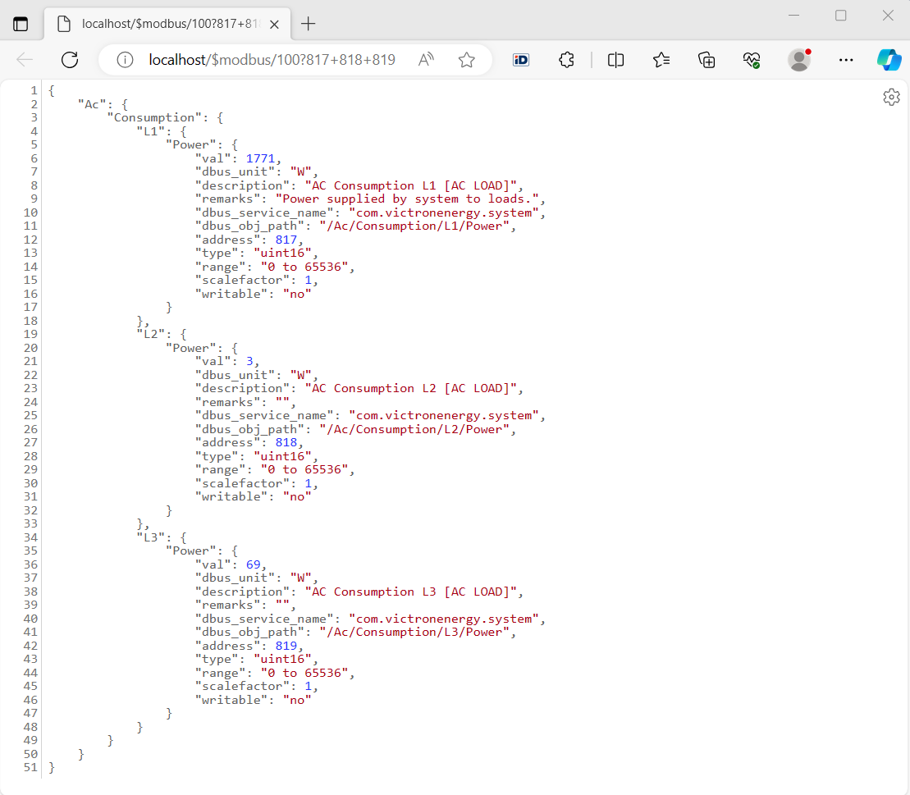

# victronenergy-modbustcp-api: helps to read and write Victron Energy GX Modbus-TCP Registers

[](https://www.npmjs.com/package/victronenergy-modbustcp-api)
[](https://www.npmjs.com/package/victronenergy-modbustcp-api)

The library helps to read and write Victron Energy GX Modbus-TCP Registers \
Please read [Documentation » ccgx » GX Modbus-TCP Manual](https://www.victronenergy.com/live/ccgx:modbustcp_faq) before starting. \
The library is designed for the package ['conextra'](https://www.npmjs.com/package/conextra).

## Table of contents

* [Installation](#installation)
* [Usage example: console-victronenergy-modbustcp-api](#usage-example-console-victronenergy-modbustcp-api)
* [Usage example: simple-modbus-api](#usage-example-simple-modbus-api)
* ['victronenergy-modbustcp-api' Reference](#victronenergy-modbustcp-api-reference)
* [License](#license)

## Installation

`npm install victronenergy-modbustcp-api`

## Usage example: [console-victronenergy-modbustcp-api](https://github.com/manuel-lohmus/victronenergy-modbustcp-api/examples/console-victronenergy-modbustcp-api/)

```js
var modbus_api = require("victronenergy-modbustcp-api");
var util = require('util');
var modbusPort = 502;
var modbusHostname = "192.168.8.106";

// request: `/$modbus/{UnitID}?${RegisterAddress}=${setValue}`
var requests = [

    // /Ac/Consumption/L1+L2+L3/Power
    `/$modbus/100?817+818+819`
];

requests.forEach(function (request) {

    requestModbusTCP(
        modbusHostname,
        modbusPort,
        request.substring(9),
        function (err, result) {

            if (err) { console.error(err); }
            console.log(util.inspect(result, { showHidden: false, depth: null, colors: true }));
        }
    );
});
```
#### Result:
 

## Usage example: [simple-modbus-api](https://github.com/manuel-lohmus/victronenergy-modbustcp-api/examples/simple-modbus-api/)

```js
'use strict';

var requestModbusTCP = require("victronenergy-modbustcp-api");
var server = require("tiny-https-server");
var options = require("config-sets");
options.init({
    modbusPort: 502,
    modbusHostname: "192.168.8.106"
});

server.on("request", function (req, res, next) {

    if (req.url.startsWith("/$modbus/")) {

        requestModbusTCP(
            options.modbusHostname,
            options.modbusPort,
            req.url.substring(9),
            function (err, result) {

                res.writeHead(200, { "Content-Type": "text/json" });
                res.write(JSON.stringify(err || result));
                res.end();
            }
        );
    }
    else
        next();
});


var port = options.tiny_https_server.port;
if (port === 80 || port === 443) { port = ""; }
else { port = ":" + port; }

/**
 * `http://localhost/$modbus/${UnitID}?${Address}=${setValue}`
 * example http://localhost/$modbus/228?33=4
 * see info: https://www.victronenergy.com/live/ccgx:modbustcp_faq
 */
var urls = [

    // /Ac/Consumption/L1+L2+L3/Power
    `http://localhost${port}/$modbus/100?817+818+819`,

    //// /Ac/Grid/L1+L2+L3/Power
    //`http://localhost${port}/$modbus/100?820+821+822`,

    //// /Dc/Battery/Power
    //`http://localhost${port}/$modbus/100?842`,

    //// /Dc/Battery/Temperature
    //`http://localhost${port}/$modbus/228?61`,

    //// /Dc/Battery/Soc
    //`http://localhost${port}/$modbus/100?843`,

    //// /Hub4/Sustain
    //`http://localhost${port}/$modbus/228?73`,

    //// //Serial
    //`http://localhost${port}/$modbus/100?800`,

    //// //Serial
    //`http://localhost${port}/$modbus/30?2609`,

    //// /Settings/Cgwacs/AcPowerSetPoint
    //`http://localhost${port}/$modbus/100?2700`,

    //// /Settings/Cgwacs/MaxChargePercentage
    //`http://localhost${port}/$modbus/100?2701`,

    //// /Settings/Cgwacs/MaxDischargePercentage
    //`http://localhost${port}/$modbus/100?2702`,

    //// /Settings/Cgwacs/AcPowerSetPoint
    //`http://localhost${port}/$modbus/100?2703`,

    //// /Settings/Cgwacs/Hub4Mode
    //`http://localhost${port}/$modbus/100?2902`,

    //// /State
    //`http://localhost${port}/$modbus/228?31`,

    //// /Switch Position
    //`http://localhost${port}/$modbus/228?33=4`,

    //// /Ac/L1|L2|L3/Energy/Forward|Reverse
    //`http://localhost${port}/$modbus/30?2603+2604+2605+2606+2607+2608`,

    //// /Ac/L1|L2|L3/Voltage|Current
    //`http://localhost${port}/$modbus/30?2616+2617+2618+2619+2620+2621`,

    //// /gps
    //`http://localhost${port}/$modbus/100?2800+2802+2804+2805+2806+2807+2808`,
];

// Opens the URLs in the browser.
while (urls.length) {
    require("browse-url")(urls.shift());
}
```
#### Result:
 

## 'victronenergy-modbustcp-api' Reference

```js

/**
 * 
 * Request Modbus TCP 
 * 
 * request: `{UnitID}?${RegisterAddress}=${setValue}`
 * example: requestModbusTCP("192.168.8.106", 502, "100?817+818+819", (err, result) => { ... })
 * see info: https://www.victronenergy.com/live/ccgx:modbustcp_faq
 * 
 * @param {string} host
 * @param {number} port example: 502
 * @param {string} request `{UnitID}?${RegisterAddress}=${setValue}`
 *  example: "100?817+818+819"
 * @param {(err:any, result:object)=>void} callback
 */
function requestModbusTCP(host, port, request, callback) 
```

## License


The MIT License [MIT](LICENSE)
```txt
The MIT License (MIT)

Copyright (c) 2023 Manuel Lõhmus <manuel@hauss.ee>

Permission is hereby granted, free of charge, to any person obtaining a copy
of this software and associated documentation files (the "Software"), to deal
in the Software without restriction, including without limitation the rights
to use, copy, modify, merge, publish, distribute, sublicense, and/or sell
copies of the Software, and to permit persons to whom the Software is
furnished to do so, subject to the following conditions:

The above copyright notice and this permission notice shall be included in all
copies or substantial portions of the Software.

THE SOFTWARE IS PROVIDED "AS IS", WITHOUT WARRANTY OF ANY KIND, EXPRESS OR
IMPLIED, INCLUDING BUT NOT LIMITED TO THE WARRANTIES OF MERCHANTABILITY,
FITNESS FOR A PARTICULAR PURPOSE AND NONINFRINGEMENT. IN NO EVENT SHALL THE
AUTHORS OR COPYRIGHT HOLDERS BE LIABLE FOR ANY CLAIM, DAMAGES OR OTHER
LIABILITY, WHETHER IN AN ACTION OF CONTRACT, TORT OR OTHERWISE, ARISING FROM,
OUT OF OR IN CONNECTION WITH THE SOFTWARE OR THE USE OR OTHER DEALINGS IN THE
SOFTWARE.
```


